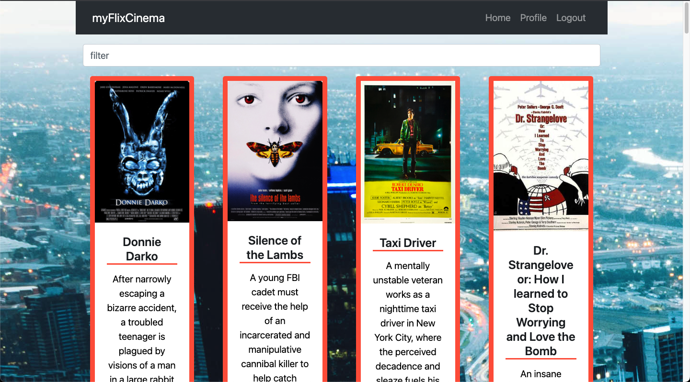

# myFlix-client

## Images

<p align="center">
  
  
</p>

## Description

myFlix Client is the frontend-side of a movies web application. The application provides users with access to information about different movies, their directors and the movie genre. Users are able to sign up, update their personal information, create a list of their favorite movies and remove movies from their favorite list.

## User Stories

- As a user, I want to be able to receive information on movies, directors, and genres so that I
  can learn more about movies I’ve watched or am interested in.
- As a user, I want to be able to create a profile so I can save data about my favorite movies.

## :key: Features

### Main View

- Returns a list of ALL movies to the user (each listed item with an image, title and description)

- Sorting and filtering

- Ability to select a movie for more details

### Single movie view

- Returns data (description, genre, director, image) about a single movie to the user

- Allows users to add a movie to their list of favorites

### Login view

- Allows users to log in with a username and password

- Registration view

- Allows new users to register (username, password, email, birthday)

### Genre view

- Returns data about a genre, with a name and description

### Director view

- Returns data about a director (name, bio)

### Profile view

- Allows users to update their user info (username, password, email, date of birth)

- Allows existing users to deregister

- Displays favorite movies

- Allows users to remove a movie from their list of favorites

## Technologies

### :hammer_and_wrench: Built With

- HTML

- SCSS

- JavaScript

- [React](https://reactjs.org/), [React-Redux](https://react-redux.js.org/)

- [React-Bootstrap](https://react-bootstrap.github.io/)

- [Parcel](https://parceljs.org/)

## :page_with_curl: Technical Requirements

- The application is a single-page application (SPA)

- The application uses state routing to navigate between views and share URLs

- The application gives users the option to filter movies

- The application gives users the option to sort movies

- The application initially uses Parcel as its build tool

- The application is written using the React library and in ES2015+

- The application is written with React Redux (hence respecting the Flux pattern)

- The application uses Bootstrap as a UI library for styling and responsiveness

- The application contains a mix of class components and function components

- The application is hosted online [Netlify.com]

## :man_technologist: Get Started

Download the repository on your machine

```
https://github.com/decisiveHoneyBadger/myFlix-client.git
```

Install dependencies

```
npm install
```

Build the app

```
parcel src/index.html
```

## :rocket: <a href="https://myflix-cinema.netlify.app">Live Demo</a>
